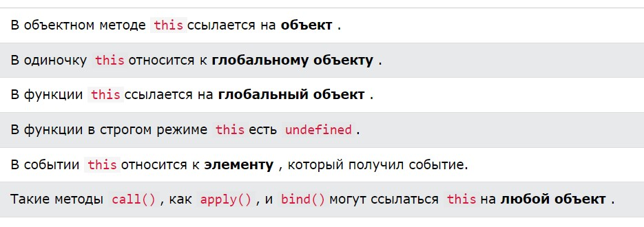

# JavaScript Objects
### Объект JavaScript — это непримитивный тип данных, который позволяет хранить несколько коллекций данных.

## Вот пример объекта JavaScript.

### Здесь student— объект, в котором хранятся такие значения, как строки и числа.

## Объявление объекта JavaScript
### Синтаксис для объявления объекта:

### Здесь объект object_nameопределен. Каждый элемент объекта представляет собой пару ключ: значение , разделенную запятыми и заключенную в фигурные скобки {}.
### Например,

### Вы также можете определить объект в одной строке.

### В приведенном выше примере nameи ageявляются ключами, а Johnи 20являются значениями соответственно.

## Свойства объекта JavaScript
### В JavaScript пары «ключ: значение» называются свойствами . Например,

### Здесь name: 'John'и age: 20есть свойства.

## Доступ к свойствам объекта
### Вы можете получить доступ к значению свойства, используя его ключ .
### 1. Использование записи через точку
### Вот синтаксис записи через точку.

## objectName.key
### Например:

## 2. Использование квадратных скобок
### Вот синтаксис скобочной записи.

## objectName["propertyName"]
### Например:

## Вложенные объекты JavaScript
### Объект также может содержать другой объект. Например,

### В приведенном выше примере объект studentсодержит значение объекта в marksсвойстве.

## Объектные методы JavaScript
### В JavaScript объект также может содержать функцию. Например,

### Здесь функция используется как значение клавиши приветствия. Вот почему нам нужно использовать person.greet()вместо person.greetвызова функции внутри объекта.

#
# JavaScript Object Destructuring
## Введение в назначение деструктуризации объектов JavaScript
### Предположим, у вас есть personобъект с двумя свойствами: firstNameи lastName.

### Если переменные имеют те же имена, что и свойства объекта, вы можете сделать код более кратким следующим образом:

### В этом примере мы объявили две переменные firstNameи lastNameи присвоили свойства объекта человека переменным в одном операторе.

### Можно разделить декларацию и присваивание. Однако вы должны заключать переменные в круглые скобки:
#
## ({firstName, lastName} = person);
#
### Если вы не используете круглые скобки, механизм JavaScript интерпретирует левую часть как блок и выдает синтаксическую ошибку.
### Когда вы присваиваете несуществующее свойство переменной с помощью деструктуризации объекта, переменной присваивается значение undefined. Например:

#
# JavaScript Object Spread
### 1) клонировать объект
### Вы можете использовать оператор распространения для клонирования собственных перечислимых свойств объекта:

### Выход:

### Обратите внимание, что клонирование всегда поверхностное. Например:

### Выход:

## 2) Объединение объектов
### Как и массивы, вы можете использовать оператор расширения ( ...) для объединения двух объектов:

### Выход:

#
# The JavaScript this Keyword
### В JavaScript thisключевое слово относится к объекту .
### Какой объект зависит от того, как this он вызывается (используется или вызывается).

### Ключевое this слово относится к разным объектам в зависимости от того, как оно используется:

## this in a Method
### При использовании в объектном методе thisссылается на объект .

### В примере вверху этой страницы thisотносится к объекту person .

### Поскольку метод fullName является методом объекта person .

#
# JavaScript Date and Time
### В JavaScript дата и время представлены объектом Date. Объект Dateпредоставляет информацию о дате и времени, а также предоставляет различные методы.

### Дата JavaScript определяет эпоху EcmaScript , которая представляет миллисекунды с 1 января 1970 года по всемирному координированному времени . Эта дата и время совпадают с эпохой UNIX (преобладающее базовое значение для записанных компьютером значений даты и времени).

## Создание объектов даты
### Существует четыре способа создания объекта даты.

## - new Date()
## - new Date(milliseconds)
## - new Date(Date string)
## - new Date(year, month, day, hours, minutes, seconds, milliseconds)

#
## new Date()

### Вы можете создать объект даты с помощью new Date()конструктора. Например,

## new Date(milliseconds)

### Объект Dateсодержит число, представляющее миллисекунды с 1 января 1970 года по Гринвичу .

### new Date(milliseconds)создает новый объект даты, добавляя миллисекунды к нулевому времени. Например,

## new Date(date string)
### new Date(date string)создает новый объект даты из строки даты.

### В JavaScript обычно существует три формата ввода даты.
#
## new Date(year, month, day, hours, minutes, seconds, milliseconds)
### new Date(year, month,...)создает новый объект даты, передавая определенную дату и время. Например,

#
## Методы даты JavaScript
### В объекте даты JavaScript доступны различные методы.

